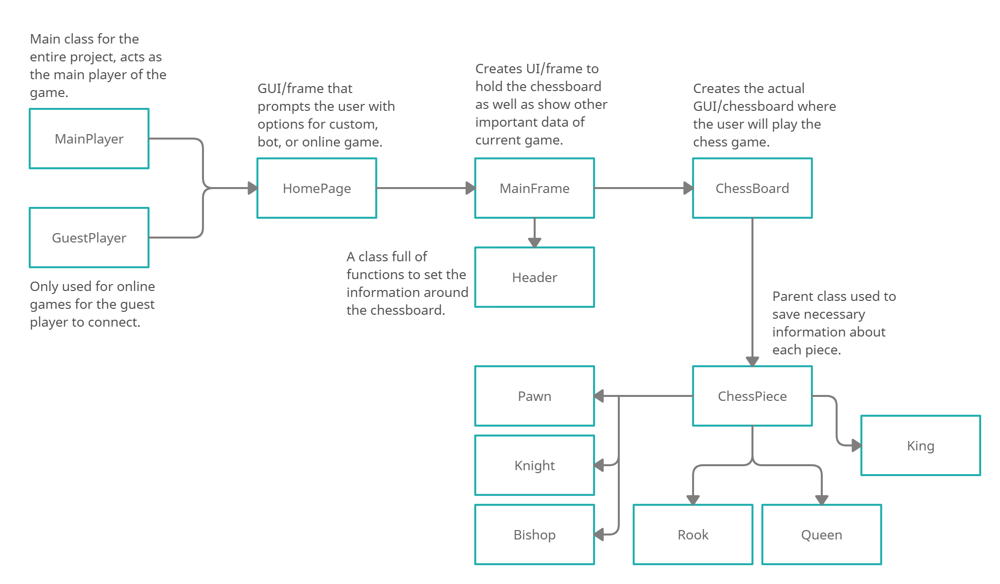
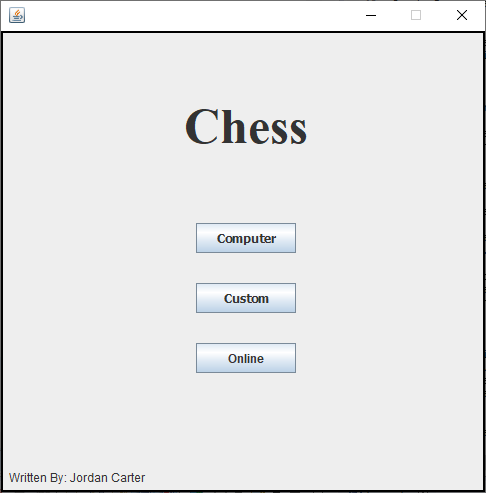
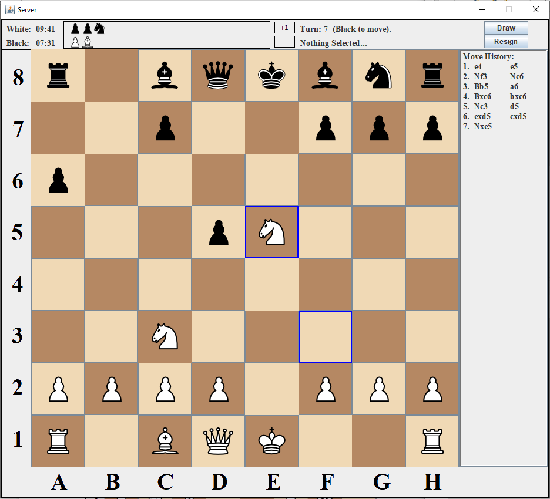
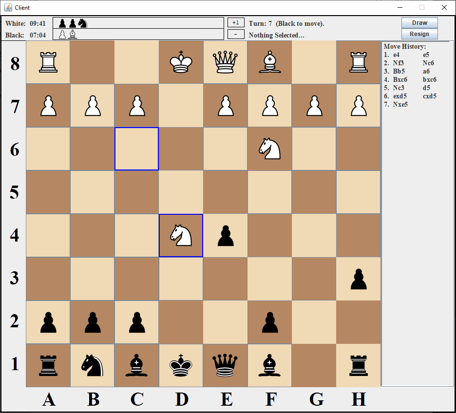

# Background
Initially the project was built as a side project over the summer, where the only plans was to build a chess game using JAVA. The initial functionality wanted was that the user can play a custom game by themselves to practice theory or a game against a simple bot to simulate playing another person. Once those modes were developed I took a network programming course where I was able to add online capability to it so a guest can join and connect to the main player to play a match online.

# Specifications
Project was built using JAVA only, and it was developed using the Eclipse IDE. More specifically, the GUIs were built using APIs such as JAVA Swing and JAVA AWT. The IDEs built in design tool for user interfaces handled all of the redundant coding automatically, which creates a basic template that allows us to make modifications alot easier. For all of the chess piece movement, collision-testing, rules, and etc it was all vanilla JAVA. The networking portion involved creating a TCP socket connection between the main player (server) and the guest player (client), so multithreading was needed to handle all of the client and server I/O data in the background of the GUIs.

# Project Pipeline
Consists of 13 classes in total, where 2 of them belong to the server/client, 3 are 
JFrames for different user interfaces, 1 is a helper class for showing information on those 
frames, and the last 7 are for chess piece data where their is a parent class along with 6 
children classes. This is shown as a flowchart in the following figure:

  

The pipeline starts with the MainPlayer class which also acts as the main class for the entire project. The User will run this class and then the HomePage will pop up to prompt the user a decision between 3 options for the game which are custom, bot, or online. For the GuestPlayer to run, it is dependent on the answer from the HomePage created by the MainPlayer, if that decision is an online game then that is the only time where the GuestPlayer is able to connect (because the server socket from the MainPlayer will be open for connection). Essentially the GuestPlayer is the client from a different location who will connect to the server (aka the MainPlayer) to play a game.

  

Irrespective of the decision in the HomePage, it will create the MainFrame which is another JFrame that will hold the gridlayout used for the chessboard as well as other swing components to hold important information about the game. Then the chessboard will be created which creates an 8x8 gridlayout where each cell in the grid acts as a JButton, then a function will be called to create the chess pieces on the board. I did it this way so that each button will be empty or contain a chess piece, so when we want to make a move we simply press the button of the chess piece and then press the button we want the chess piece to move too. Of course it’s not that simple, but the functions I’ve created in the class will take care of that process and check if it’s a valid move before processing it (if interested check out the action performed function in ChessBoard.java, it is the main function for processing/validating moves on the board).

  
  

Each type of piece on the chessboard have their own respectful class where each of those classes 
inherits the main ChessPiece class. This parent class provides useful information like the pieces 
properties and setting the pieces position. With that information the class for the piece types 
provide all of the functions for moving the pieces or taking another piece (collision-testing). A
lot of the code in these classes are re-used in other classes (example: the queen class shares 
movement with almost every other class). Along with ChessBoard, the King class is one of the most important classes because it contains the functions to check for checks and checkmates. 
